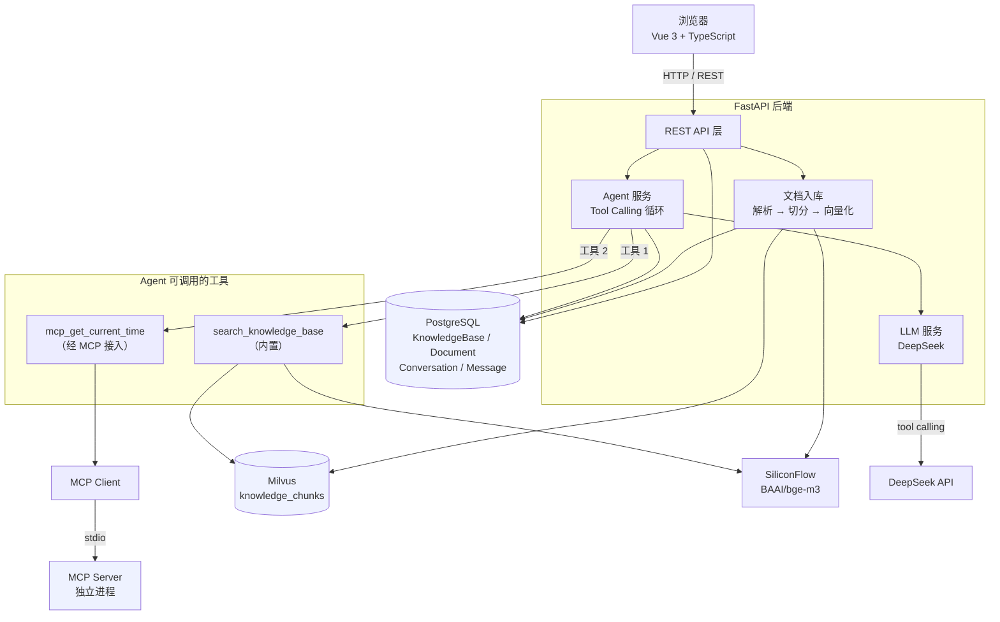
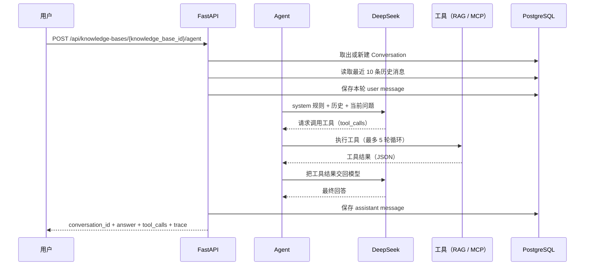
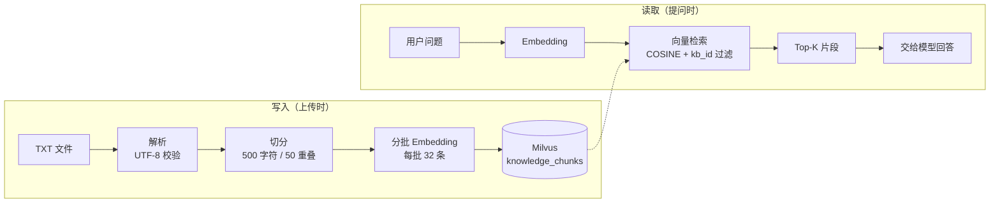

# AI 智能知识库 Agent 平台

一个全栈 AI Agent 项目：把私有文档变成可检索的知识库，再让大模型基于这些知识回答问题。

## 项目简介

大模型有两个固有的问题：它不知道你的私有文档，而且**它分不清「我不知道」和「我编一个听起来合理的」**。一个只靠提示词的问答机器人，会把编造的内容以同样自信的语气说出来 —— 在知识库场景下这比直接说不知道危险得多。

这个项目用 **RAG** 解决第一个问题（把相关资料检索出来喂给模型），用 **Agent + Tool Calling** 解决第二个问题（让模型自己决定要不要查资料、查什么），并用 **MCP** 把「工具」从应用内部解耦成可替换的独立服务。

定位是一个**可直接运行的完整平台**：前端界面、后端 API、关系库、向量库、模型服务、容器化部署都已打通，而不是一个跑在 notebook 里的 demo。

---

## 核心功能

| 功能 | 说明 |
| --- | --- |
| **知识库管理** | 创建、查询、列表、删除知识库；删除时级联清理文档、会话、向量与磁盘文件 |
| **TXT 文档上传与解析** | 上传 TXT，校验编码与大小，落盘后同步完成入库 |
| **文档切分与向量化** | 按语义边界切分为带重叠的片段，分批调用 Embedding 接口 |
| **RAG 知识库检索** | 独立的语义检索接口，支持 top_k 与知识库隔离 |
| **基于 DeepSeek 的 Agent** | 模型自主决定是否调用工具，而不是每次都固定检索 |
| **Agent Tool Calling** | 内置检索工具 + 白名单校验 + 参数收敛 + 多轮工具循环 |
| **MCP Tool** | 通过 MCP 协议接入独立工具服务（当前提供时间查询） |
| **多轮对话与持久化** | `conversation_id` 串联上下文，消息落 PostgreSQL，刷新后数据仍在 |
| **前后端完整交互** | Vue 3 + TypeScript 界面，通过 REST API 与后端通信 |
| **三层 Evaluation** | Tool Calling / RAG / Final Answer 三层可重复评测，确定性检查优先 + LLM 判官兜底 |
| **Docker Compose 一键部署** | 7 个服务编排，含健康检查、迁移自动执行、数据卷持久化 |

---

## 技术栈

**前端**
`Vue 3` · `TypeScript` · `Vite` · `Nginx`

**后端**
`FastAPI` · `SQLAlchemy Async` · `Alembic` · `PostgreSQL 16`

**AI**
`DeepSeek`（生成） · `SiliconFlow`（Embedding 托管） · `BAAI/bge-m3`（向量模型） · `Milvus`（向量库） · `RAG` · `Tool Calling` · `MCP`

**部署**
`Docker` · `Docker Compose`

> **为什么向量化不用 DeepSeek**：DeepSeek 官方 API 只提供生成模型，没有 embedding 接口（调用 `/embeddings` 返回 404）。所以 RAG 的两半由两家分别承担 —— 生成用 DeepSeek，向量化用硅基流动托管的 `BAAI/bge-m3`。两者都是 OpenAI 兼容接口，复用同一个 SDK。

---

## 系统架构



**几个关键设计**

- **Agent 不直接执行工具**：它只决定「调哪个工具、传什么参数」，真正的执行由服务层完成。知识库 ID 由服务端从 URL 取出，模型无法影响。
- **MCP Client 与 MCP Server 之间是 stdio**：Server 由 Client 作为子进程拉起，不占端口、不需要单独部署。
- **PostgreSQL 是业务数据的唯一真相**，Milvus 是可以从 PostgreSQL + 原始文件重建出来的索引。

---

## Agent 工作流程



全程用轻量 Trace 记录每一轮模型调用与工具调用的耗时、成败（见下文「运行记录」）。

Agent 与固定的 RAG 问答（`/ask`）的区别在于**「要不要检索」的判断权**：`/ask` 每次都固定先检索再作答；`/agent` 把这个问题交给模型，所以「你好」这类寒暄不会被硬塞进一堆无关检索结果。

---

## RAG 流程



- **切分按语义边界**：优先在段落、句号处断开，找不到才硬切。切太碎会丢上下文，切太长会把无关内容一起召回。
- **片段之间保留重叠**：防止一个完整的语义单元正好横跨切分点。
- **检索必须带 `knowledge_base_id` 过滤**：不加过滤会跨库检索，既是数据泄漏，也会让无关内容挤占 top_k 名额。

---

## MCP 设计

MCP（Model Context Protocol）把工具的实现和调用方解耦 —— 工具可以换实现、换语言、甚至换成远程服务，调用方不用改代码。

**当前实现**

```
Agent
  └─ mcp_get_current_time        ← 暴露给模型的工具名（带 mcp_ 前缀）
       └─ MCP Client             ← services/mcp_client.py
            └─ stdio 子进程       ← 由 Client 拉起，不占端口
                 └─ MCP Server   ← app/mcp_server/server.py
                      └─ get_current_time(timezone)
```

- **传输方式**：stdio。Client 用 `python -m app.mcp_server.server` 把 Server 作为子进程拉起，通过标准输入输出通信。
- **当前工具**：`get_current_time`，支持 `Asia/Shanghai`、`Asia/Tokyo`、`UTC` 三个时区（白名单）。
- **运行位置**：MCP Server 作为子进程运行在 **backend 容器内**，**不作为 HTTP 服务暴露**。
- **工具名加前缀**：避免与内置工具撞名，也让「工具来自哪里」在名字上一目了然。
- **动态白名单**：只允许调用本次实际发现到的工具，模型无法凭空指定一个名字。

MCP Server 不 import 应用的任何东西（不依赖 FastAPI、SQLAlchemy、Milvus），只依赖标准库 + MCP SDK —— 它要被当成一个独立的工具服务，而不是应用的一块内部代码。

> 说明：MCP SDK 2.x 把 `FastMCP` 改名为 `MCPServer`，网上大量基于 1.x 的示例在这个版本上跑不起来。

---

## 数据库设计

**PostgreSQL（业务数据）**

| 表 | 作用 |
| --- | --- |
| `knowledge_bases` | 知识库：名称、描述 |
| `documents` | 文档：文件名、存储路径、处理状态、切片数 |
| `conversations` | 会话：所属知识库、标题 |
| `messages` | 消息：所属会话、角色（user/assistant）、正文 |

关系：`knowledge_bases → documents`、`knowledge_bases → conversations → messages`，均配置 `ON DELETE CASCADE`，删除知识库时由数据库一条语句级联清理。

**Milvus（向量数据）**

Collection `knowledge_chunks`，维度 1024（与 bge-m3 输出一致）：

| 字段 | 类型 | 说明 |
| --- | --- | --- |
| `id` | INT64 | Milvus 自增主键 |
| `knowledge_base_id` | VARCHAR | 检索时的过滤字段（建 INVERTED 索引） |
| `document_id` | VARCHAR | 用于按文档批量删除 |
| `chunk_id` | VARCHAR | 对应 PostgreSQL 中切片的标识 |
| `content` | VARCHAR | 片段正文 |
| `vector` | FLOAT_VECTOR | 1024 维，COSINE 相似度 |

**分工原则**：PostgreSQL 存业务事实（可事务、可关联查询），Milvus 存向量（擅长近似最近邻但不支持事务）。

两者之间**没有分布式事务**，跨存储的写入与删除无法原子完成。当前的做法是固定操作顺序来降低不一致的风险：删除时**先清理 Milvus，成功后才删 PostgreSQL**；Milvus 清理失败则中止整个删除并返回错误，PostgreSQL 记录保持不动，调用方可以重试。选择这个顺序，是让出错时残留下来的状态偏向「记录仍在、向量已清」——这种状态可发现、可重试；而反过来先删记录的话，Milvus 里的向量就失去了关联线索，难以再定位清理。这是对风险的取舍与控制，不是强一致性保证。

---

## API 示例

完整接口文档：启动后端后访问 `http://localhost:8000/docs`。

### 创建知识库

```http
POST /api/knowledge-bases
Content-Type: application/json

{ "name": "产品文档", "description": "内部产品资料" }
```

```json
201 Created
{
  "id": "5e5d6126-71e6-4f01-b79a-215bbab9cc8a",
  "name": "产品文档",
  "description": "内部产品资料",
  "created_at": "2026-09-21T14:44:21.932349Z",
  "updated_at": "2026-09-21T14:44:21.932352Z",
  "document_count": 0
}
```

### 获取知识库列表

```http
GET /api/knowledge-bases
```

返回知识库数组（按创建时间倒序），每项含实时统计的 `document_count`。

### 上传 TXT 文档

```http
POST /api/documents/upload
Content-Type: multipart/form-data

file=<example.txt>
knowledge_base_id=<知识库 UUID>
```

```json
201 Created
{
  "id": "0cd57db1-1f1f-4b3f-b5e4-7ada777a17d4",
  "knowledge_base_id": "5e5d6126-...",
  "name": "example.txt",
  "file_type": "txt",
  "status": "completed",
  "chunk_count": 1,
  "error_message": null,
  "created_at": "...",
  "updated_at": "..."
}
```

上传同步完成解析、切分、向量化与入库，返回时 `status` 已是 `completed`。

### RAG 检索

```http
POST /api/knowledge-bases/{knowledge_base_id}/search
Content-Type: application/json

{ "query": "Milvus 是什么", "top_k": 5 }
```

```json
200 OK
{
  "query": "Milvus 是什么",
  "results": [
    {
      "chunk_id": "0cd57db1-...-chunk-000001",
      "document_id": "0cd57db1-...",
      "content": "Milvus 是一个开源的向量数据库。",
      "score": 0.6664
    }
  ]
}
```

`top_k` 范围 1~20，默认 5。`score` 是余弦相似度，越大越相似。

### Agent 对话（支持多轮）

```http
POST /api/knowledge-bases/{knowledge_base_id}/agent
Content-Type: application/json

{ "question": "Milvus 是什么？" }
```

```json
200 OK
{
  "conversation_id": "95a4331c-a288-4f11-9c98-ccc98f722fec",
  "answer": "根据知识库中的资料，Milvus 是一个开源的向量数据库……",
  "tool_calls": [
    {
      "tool": "search_knowledge_base",
      "arguments": { "query": "Milvus 是什么", "top_k": 5 },
      "query": "Milvus 是什么",
      "top_k": 5
    }
  ],
  "trace_id": "3f2a1c8e-9b4d-4f0a-8f1e-2b6c7d5a9e10",
  "iterations": 2,
  "llm_calls": [
    { "model": "deepseek-chat", "duration_ms": 640.2, "success": true, "error": null },
    { "model": "deepseek-chat", "duration_ms": 1180.05, "success": true, "error": null }
  ],
  "total_duration_ms": 1820.4
}
```

多轮对话：把上一轮返回的 `conversation_id` 原样传回来，模型即可看到之前的问答。

```json
{ "question": "它有什么特点？", "conversation_id": "95a4331c-..." }
```

`tool_calls` 记录本轮实际执行过的工具（内置工具与 MCP 工具都会出现），便于解释「答案是怎么来的」。

#### 运行记录（Trace）

响应里的 `trace_id` / `iterations` / `llm_calls` / `total_duration_ms` 是这一次运行的轻量运行记录：

| 字段 | 含义 |
| --- | --- |
| `trace_id` | 本次运行的唯一标识，服务端日志里按它就能捞到同一轮的完整记录 |
| `iterations` | 「调模型 → 执行工具」循环了几轮；等于 5 说明模型在打转、已被强制收敛 |
| `llm_calls` | 每一次模型调用的耗时与成败（`success=false` 时 `error` 给出原因） |
| `total_duration_ms` | 从收到问题到拿到回答的总耗时 |

它的用途是回答「这一轮慢在哪、卡在哪」：比如 `total_duration_ms` 远大于 `llm_calls`
的耗时之和，说明时间花在检索上；`iterations` 顶到 5 则说明模型在反复调工具。

Trace 只在当前请求内存在，不落库。服务端内部还会额外记录被拒绝的工具调用
（模型请求了白名单之外的工具），这类信息不通过接口暴露，只体现在日志里。
出于安全考虑，Trace 不记录 API Key、完整 prompt 或消息内容。

### 删除知识库

```http
DELETE /api/knowledge-bases/{knowledge_base_id}
```

```
204 No Content
```

同时清理 PostgreSQL 记录（级联删除文档与会话）、Milvus 向量、磁盘上的原始文件。删除按固定顺序进行：**先清理 Milvus，成功后才删 PostgreSQL**；Milvus 清理失败时返回 500 并保留 PostgreSQL 记录，调用方可以重试。这个顺序用于降低跨存储删除出现不一致的风险，并非分布式事务保证。

---

## Docker 部署

### 准备配置

```bash
cp .env.docker.example .env.docker
```

编辑 `.env.docker`，**必填**两项：

| 变量 | 说明 |
| --- | --- |
| `POSTGRES_PASSWORD` | 数据库密码（未设置时 compose 直接报错退出） |
| `DEEPSEEK_API_KEY` | DeepSeek API Key |
| `SILICONFLOW_API_KEY` | 硅基流动 API Key（用于向量化） |

容器内的主机名与本地不同：`POSTGRES_HOST=postgres`、`MILVUS_HOST=milvus` —— 容器里的 `localhost` 指的是容器自己。

> `.env.docker` 已被 `.gitignore` 忽略，不会进版本库；仓库里只有 `.env.docker.example` 模板。

### 启动

```bash
docker compose up -d --build
```

### 服务关系与端口

| 服务 | 作用 | 宿主机端口 |
| --- | --- | --- |
| `frontend` | Nginx 提供 Vue 构建产物 | **80** |
| `backend` | FastAPI + MCP Server 子进程 | **8000** |
| `postgres` | 业务数据 | **5432** |
| `milvus` | 向量库 | **19530** |
| `etcd` | Milvus 元数据依赖 | 不暴露 |
| `minio` | Milvus 对象存储依赖 | 不暴露 |
| `milvus-volume-init` | 一次性卷属主初始化后退出 | — |

启动顺序由健康检查控制：`postgres` 与 `milvus` 就绪后 `backend` 才启动，`backend` 就绪后 `frontend` 才启动。backend 启动时会依次执行**数据库迁移** → **创建 Milvus 集合** → 启动服务，任一步失败即中止（不让服务在「集合不存在」的状态下起来，否则每个上传请求都会 500）。

### 访问

- 前端：http://localhost
- 接口文档：http://localhost:8000/docs
- 健康检查：http://localhost:8000/health

### 数据持久化

全部使用 Docker 命名卷（`postgres_data`、`etcd_data`、`minio_data`、`milvus_data`、`backend_storage`），数据不落在宿主机路径上。`docker compose down` 不会删除它们，需要显式 `-v`。

---

## 本地开发

本地开发与 Docker 部署互不影响，用的是同一份代码、不同的配置来源。

**后端**

```bash
cd backend
pip install -r requirements.txt
# 在仓库根目录准备 .env（可从 .env.example 复制），数据库指向 localhost
alembic upgrade head
uvicorn app.main:app --reload
```

**前端**

```bash
cd frontend
npm install
npm run dev          # http://127.0.0.1:5173
```

前端后端地址通过 `frontend/.env` 的 `VITE_API_BASE_URL` 配置（可从 `frontend/.env.example` 复制），默认 `http://127.0.0.1:8000`。

> 前端环境变量会在**构建时**打包进产物（浏览器可见），所以只能放地址这类公开信息，**绝不能放 API Key**。

---

## 项目目录结构

```
.
├── backend/
│   ├── app/
│   │   ├── api/                  # REST 接口层（薄，只做参数校验与转发）
│   │   │   ├── agent.py          #   Agent 对话（多轮）
│   │   │   ├── chat.py           #   基础对话
│   │   │   ├── documents.py      #   文档上传/查询/删除
│   │   │   ├── health.py         #   健康检查
│   │   │   ├── knowledge_bases.py#   知识库 CRUD
│   │   │   ├── qa.py             #   RAG 问答
│   │   │   └── search.py         #   语义检索
│   │   ├── core/
│   │   │   ├── config.py         # 配置（全部来自环境变量）
│   │   │   ├── database.py       # 异步引擎与会话
│   │   │   └── milvus.py         # 向量库连接与集合初始化
│   │   ├── models/               # SQLAlchemy 模型
│   │   ├── schemas/              # Pydantic 请求/响应模型
│   │   ├── services/             # 业务逻辑
│   │   │   ├── agent.py          #   Agent 循环与工具编排
│   │   │   ├── llm.py            #   DeepSeek 调用
│   │   │   ├── embedding.py      #   文本向量化
│   │   │   ├── vector_store.py   #   Milvus 读写
│   │   │   ├── mcp_client.py     #   MCP 客户端
│   │   │   ├── conversation.py   #   会话历史
│   │   │   ├── knowledge_base.py #   知识库与级联清理
│   │   │   ├── trace.py          #   Agent 运行记录（轻量 Trace）
│   │   │   └── document/         #   解析 → 切分 → 入库
│   │   ├── mcp_server/           # MCP Server（独立进程，不依赖应用）
│   │   └── main.py               # 应用入口
│   ├── alembic/versions/         # 数据库迁移
│   ├── tests/
│   │   ├── unit/                 # pytest 单元测试（不联网，任何机器可跑）
│   │   └── evals/                # Evaluation V1：三层评测
│   │       ├── datasets/         #   用例（jsonl，人工标注）
│   │       ├── graders/          #   判定逻辑（纯函数 + LLM 判官）
│   │       ├── fixtures/         #   评测语料
│   │       ├── schemas.py        #   用例与结果模型
│   │       └── runner.py         #   CLI 入口
│   ├── pytest.ini                # pytest 配置
│   ├── Dockerfile
│   └── requirements.txt
├── frontend/
│   ├── src/
│   │   ├── api/                  # HTTP 客户端（fetch 收口于此）
│   │   ├── components/           # 侧栏、对话区、消息、输入框、工具调用展示
│   │   ├── views/HomeView.vue    # 页面容器（状态的唯一持有者）
│   │   ├── types.ts              # 与后端字段一致的 TypeScript 类型
│   │   └── style.css
│   ├── nginx.conf                # history 回退与缓存策略
│   ├── Dockerfile
│   └── vite.config.ts
├── docker-compose.yml
├── .env.example                  # 本地开发配置模板
└── .env.docker.example           # Docker 部署配置模板
```

---

## 测试与验证

### 自动化测试

仓库中有可运行的 pytest 测试套件：用例位于 `backend/tests/unit/`，配置见 `backend/pytest.ini`，
依赖 `pytest` / `pytest-asyncio` 已写入 `backend/requirements.txt`。

```bash
cd backend && pytest
```

当前共 **36 个单元测试**，集中在 Agent 的 Trace 链路、工具契约与评测判定逻辑上。它们把外部依赖（LLM、MCP、embedding、向量库）
全部替换为假实现 —— 不联网、不连库、不起子进程，因此在任何机器上都能跑：

| 文件 | 覆盖内容 |
| --- | --- |
| `tests/unit/test_trace.py` | `trace_id` 生成（uuid4 形状与唯一性）、LLM 调用与工具调用的耗时记录、失败标记、`finish()` 的幂等与错误记录、**异常不被 Trace 吞掉** |
| `tests/unit/test_agent_trace.py` | 每次模型调用与工具调用的耗时、轮数、工具失败不使 Agent 崩溃、被拒绝的工具调用记为失败、强制收敛路径、异常时 `trace.error` 记录、接口层的字段映射 |
| `tests/unit/test_agent_tool_contract.py` | **工具契约**：`top_k` 超过上限收敛到 5、范围内原样保留、`0`/负数/非整数被拒绝（不收敛）、`query` 先 strip 再校验长度、超长拒绝、`knowledge_base_id` 等多余字段被静默丢弃 |
| `tests/unit/test_eval_tool_calling_grader.py` | 评测 grader 的 `tool_selection` F1 计算：选对为 1、**全选错必须为 0**（这里出过一个把「工具全选错」记成满分的 bug）、双方都为空为 1、部分命中落在 (0,1)、`allow_extra_tools` 只放过多调不放过漏调 |

> `top_k` 的边界为什么是单测而不是评测用例：顺着 Agent 的执行路径走，模型给出 `top_k=1000` 时，**有**收敛逻辑就改成 5 并通过校验，**没有**收敛逻辑就被范围校验整次拒绝、`arguments` 保持 `{}`。两种情况下观测到的 `top_k` 都不超过 5，所以在评测数据集里写「`top_k <= 5`」是一条**不可能失败**的断言。真正能区分「有收敛」和「没收敛」的只有直接调函数的单测。

### Evaluation（三层评测）

`backend/tests/evals/` 是一套**可重复运行**的三层评测，跑在真实链路上，用来回答「改动之后系统是变好了还是变差了」：

| 层 | 评什么 | 指标 |
| --- | --- | --- |
| **Tool Calling** | 模型有没有选对工具、传对参数、调对次数 | Selection（F1）/ Arguments（逐字段匹配器）/ Call Count / Order（子序列）/ Error |
| **RAG** | **直接评检索结果**，完全不经过模型、不看答案 | Hit@K / Recall@K / MRR / 非空归因 |
| **Final Answer** | 答案对不对、切不切题、有没有依据 | 拒答判定 / 事实子串 / 禁用词（确定性）+ Relevance / Groundedness（LLM 判官） |

```bash
cd backend
python -m tests.evals.runner --layer all
python -m tests.evals.runner --layer rag
python -m tests.evals.runner --layer tool_calling --limit 10
python -m tests.evals.runner --layer final_answer --no-judge --limit 10
```

报告写到 `backend/tests/evals/reports/<run_id>.json`。完整说明见 [`backend/tests/evals/README.md`](backend/tests/evals/README.md)。

几个值得说的设计取舍：

- **评测与生产解耦**：`evals` 只 import `app.services.*`，`app/` 下没有任何一处反向依赖。三层跑的都是生产链路的真实函数，一行检索或 Agent 逻辑都没有重写。
- **确定性检查优先**：事实正确性靠子串匹配、拒答靠标记、参数靠匹配器，全部可复现。LLM 判官只用在真正需要语义理解的 Relevance / Groundedness 上（占 35% 权重），并固定 `temperature=0.0`。
- **RAG 不经答案判断**：数据集里连 `answer` 字段都没有。「检索没找到」和「找到了但没用好」必须分开归因，否则调优方向会被带偏。
- **`invalid` 与 `failed` 分开**：接口挂了、判官输出看不懂记为 `invalid`，且**从 `pass_rate` 的分母里排除** —— 一次网络抖动不该看起来像能力退化。
- **不落库、不改 schema**：评测语料用 uuid5 派生的裸 `knowledge_base_id` 只写 Milvus，PostgreSQL 一行都不写，因此不需要建库、不需要跑迁移；运行前先清空、运行后在 `finally` 里清理。

### 真实链路验证

以下验证跑在真实的 DeepSeek / Milvus / MCP Server 上（这部分目前仍是临时脚本，尚未纳入版本库）。

### 真实链路验证

以下验证跑在真实的 DeepSeek / Milvus / MCP Server 上（这部分目前仍是临时脚本，尚未纳入版本库）。

| 类别 | 内容 |
| --- | --- |
| Agent E2E | 问题 → DeepSeek → `search_knowledge_base` → Milvus → 工具结果 → DeepSeek → 最终回答；响应中的 `trace_id` / `iterations` / `llm_calls` / `total_duration_ms` / `tool_calls` 全部正确回填（见「运行记录（Trace）」） |
| MCP E2E | 问题 → DeepSeek → MCP 工具 → MCP Server（独立进程）→ 工具结果 → DeepSeek → 最终回答；实际拉起 MCP Server、发现工具、调用并取回结果 |
| 工具轮数与收敛 | `MAX_TOOL_ITERATIONS = 5` 生效，用满后强制收敛为直接作答（收敛那一次走不带工具的 `chat()`，且不计入 `iterations`） |
| 工具失败不中断 | 检索链路不可用时，错误作为工具结果回给模型，Agent 照常作答而不是整体失败；Trace 中记为 `success=false`，详细堆栈只进日志 |
| 安全边界 | 诱导模型在工具参数里指定 `knowledge_base_id` 无效（实际参数只有 `query` / `top_k`）；内置白名单与 MCP 动态白名单均拒绝名单外的工具名；提示词注入（知识库内容与历史消息两个入口）、模型伪造工具参数、内部异常不泄漏 |
| 消息结构 | `assistant`（含 `tool_calls`）消息先于对应的 `role=tool` 消息，且 `tool_call_id` 一一对应 |
| 会话持久化 | 会话与消息落 PostgreSQL；多轮请求复用同一 `conversation_id`，每轮生成新的 `trace_id`，历史条数有上限，跨知识库会话被拒绝，Agent 失败时不产生虚假回答 |
| 接口功能测试 | 知识库 CRUD、文档上传/删除、检索、问答、Agent 各接口的正常路径与错误路径；覆盖参数校验边界（名称长度、描述长度、top_k 范围、空问题、超长输入） |
| `/ask` 回归测试 | 抽取共享模块后单独验证行为未变，含角色白名单过滤（构造 `role=system` 的脏数据，确认被拦下） |
| 前端构建 | `vue-tsc -b && vite build` 通过，无类型错误，全程未使用 `any` |
| Docker E2E | 完整栈启动后跑通：建库 → 上传 → 检索 → Agent 多轮 → MCP 工具 → 删除 → 数据清零 |

**尚未覆盖**

- 单元用例目前只覆盖 Agent Trace 链路与评测 grader；文档解析与切分、向量入库、知识库级联删除、MCP 会话生命周期等模块仍依赖人工验证。
- 真实链路验证需要外部服务与 API Key，尚未整理成可重复运行的集成测试（Evaluation 那三层已经纳入了版本库，但它们需要真实服务，不随 `pytest` 一起跑）。
- Evaluation 尚未覆盖：Reliability（同一数据集多次运行的方差）、回归 Dashboard、`/ask` 路径的最终答案评测。

---

## 项目亮点

**Agent 与 Tool Calling**
实现了完整的工具调用循环：模型判断 → 执行工具 → 结果回传 → 继续推理，直到给出最终回答。带工具白名单、参数收敛（模型要求 1000 条会收敛到上限）、工具执行失败不中断对话，以及轮数上限后的优雅收敛。

**RAG 全链路**
从文件上传到语义检索完整打通，包含编码校验、语义边界切分、批量向量化、失败回滚清理。切分参数、Embedding 批次大小都可调。

**MCP 集成**
把工具通过 MCP 协议解耦成独立进程。Agent 只与 MCP Client 交互，不触碰 Server 实现 —— 换一个 Server 实现（甚至换成远程的）调用方不用改代码。

**多轮对话持久化**
会话与消息落 PostgreSQL，历史按「最近 N 条」限制避免上下文无限增长。会话归属通过数据库字段校验，跨知识库的会话 ID 会被拒绝。

**PostgreSQL + Milvus 双存储**
关系库存业务事实，向量库存索引。两者之间没有分布式事务，跨存储的写入与删除无法原子完成，因此都固定了操作顺序来降低不一致的风险：**写入时先写 Milvus 再提交 PostgreSQL，删除时先清 Milvus 再删记录**，Milvus 侧失败就中止后续步骤并做补偿清理。这样即使出错，留下的也偏向「记录仍在、向量已清」这类可发现、可重试的状态，而不是失去关联线索、难以定位的残留数据。这是风险控制，不是强一致性保证。

**异步 FastAPI**
数据库、向量库、模型调用全部异步。项目里唯一同步的 pymilvus 客户端也被 `asyncio.to_thread` 包装，不阻塞事件循环。

**错误处理与数据清理**
删除知识库时会同时清理 PostgreSQL（级联）、Milvus 向量、磁盘文件三处 —— 少清任何一处都会留下无法定位的垃圾数据。所有对外错误都只返回可读文案，内部细节（连接串、堆栈、主机名）只进日志。

**前后端完整闭环**
Vue 3 + TypeScript 界面，包含知识库管理、对话、工具调用展示。前端类型与后端字段严格对齐，API 调用收口在单一客户端模块。

**Docker Compose 一键部署**
7 个服务编排，含健康检查驱动的启动顺序、迁移自动执行、集合自动初始化、命名卷持久化。

---

## 当前限制

- **文档格式仅支持 TXT**，且必须为 UTF-8 编码（Windows 记事本保存的 GBK 中文文档会被拒绝，需要先转码）。
- **无用户认证与权限控制**：任何知道 `knowledge_base_id` 的调用方都能读写对应知识库。
- **无流式输出**：Agent 回答是等全部生成完再返回，端到端耗时通常在数秒到十几秒。
- **无会话管理接口**：会话只能创建和级联删除，没有列表与单独删除的 API；前端刷新页面后会话 ID 丢失（后端数据仍在）。
- **检索无相似度阈值**：即使最相关的片段相似度很低也会被返回并交给模型。
- **历史消息按条数而非 token 数限制**：10 条长消息仍可能占用大量上下文。
- **部分常量硬编码在代码中**（切分参数、历史条数、工具轮数上限等），尚未收敛到配置文件。

---

## 后续规划

- **多格式文档**：PDF / Word / Markdown 解析（当前解析层已按格式分文件组织，扩展时新增解析器即可）
- **流式输出**：接入 SSE，改善长回答的等待体验
- **用户认证与权限**：知识库级别的访问控制
- **对话管理**：会话列表、重命名、单独删除的 API 与界面
- **更多 MCP Tools**：当前 MCP Client / Server 架构支持扩展多个工具，后续可继续增加时间查询之外的工具。
- **Agent 可观测性**：工具调用链路追踪与耗时统计已落地（见「运行记录（Trace）」），后续补充失败率统计与 Trace 持久化
- **测试体系**：Agent Trace 链路与评测 grader 已有 pytest 用例，三层 Evaluation 已可重复运行；后续把其余真实链路验证也整理成可重复运行的集成测试，并补齐其余模块的用例
- **检索优化**：相似度阈值、混合检索（关键词 + 向量）、重排序
