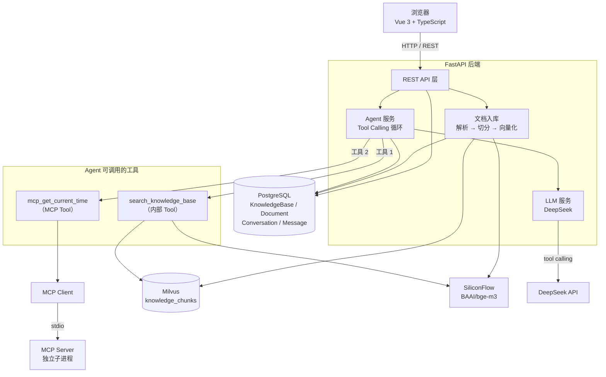
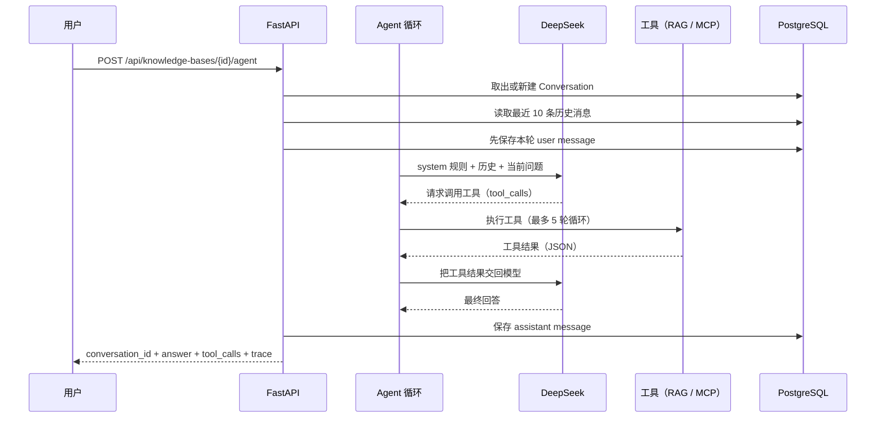
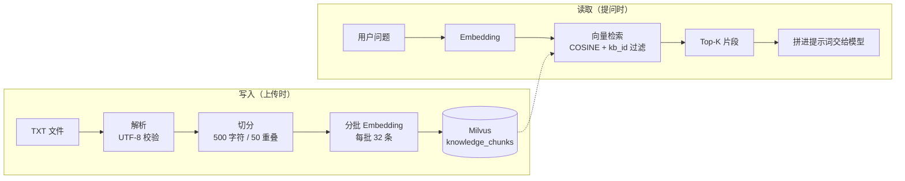

# AI 智能知识库 Agent 平台

一个可直接运行的全栈 AI Agent 项目：把私有文档变成可检索的知识库，让大模型**自主决定**要不要查资料、查什么，并把「这一轮是怎么跑出来的」完整记录下来。

`FastAPI` · `Vue 3 + TypeScript` · `PostgreSQL` · `Milvus` · `DeepSeek` · `Agent Tool Calling` · `RAG` · `MCP` · `Trace` · `Evaluation` · `Regression` · `Docker Compose`

---

## 项目简介

大模型有两个固有的问题：**它不知道你的私有文档**，而且**它分不清「我不知道」和「我编一个听起来合理的」**。一个只靠提示词的问答机器人，会把编造的内容用同样自信的语气说出来 —— 在知识库场景下，这比直接说「不知道」危险得多。

这个项目用 **RAG** 解决第一个问题（把相关资料检索出来喂给模型），用 **Agent + Tool Calling** 解决第二个问题（让模型自己判断要不要查、查什么），并用 **MCP** 把「工具」从应用内部解耦成可替换的独立服务。

定位是一个**跑得起来的完整平台**，而不是 notebook 里的 demo：前端界面、REST API、关系库、向量库、模型服务、容器化部署全部打通，并且**每一项核心能力都有可重复运行的验证**（52 条用例的一键回归 + 三层评测）。

---

## 核心功能

| 功能 | 说明 |
| --- | --- |
| **知识库管理** | 创建 / 查询 / 列表 / 删除；删除时级联清理文档、会话、向量与磁盘文件 |
| **TXT 文档上传与入库** | 校验扩展名、编码（UTF-8）、大小，落盘后同步完成解析 → 切分 → 向量化 → 写 Milvus |
| **文档切分** | 按语义边界切分（段落 / 句号优先，找不到才硬切），片段之间保留重叠 |
| **RAG 语义检索** | 独立的检索接口，带 `knowledge_base_id` 过滤（库与库之间天然隔离） |
| **RAG 问答（`/ask`）** | 固定「先检索再作答」，返回答案 + **实际用到的检索结果（含相似度）** |
| **Agent 对话（`/agent`）** | 由模型自主决定是否调用工具，支持多轮上下文与多步工具循环 |
| **Agent Tool Calling** | 内部工具 + MCP 工具统一编排：白名单校验、参数收敛、失败不中断、轮数上限后强制收敛 |
| **MCP Tool** | 通过 MCP 协议（stdio）接入独立工具进程，当前提供时区时间查询 |
| **Trace / 可观测性** | 每轮记录模型调用与工具调用的耗时、成败、轮数，随响应返回 `trace_id` 等 4 个字段 |
| **多轮对话持久化** | `conversation_id` 串联上下文，会话与消息落 PostgreSQL，历史按最近 10 条截取 |
| **Vue 3 前端** | 文档 / RAG / Agent 三块界面，含工具调用与运行记录展示、错误与加载状态 |
| **三层 Evaluation** | Tool Calling / RAG / Final Answer，确定性检查优先 + LLM 判官兜底 |
| **Regression V1** | `pytest -m regression` 一条命令跑完 7 项核心能力，本机实测 **52 passed** |
| **Docker Compose 一键部署** | 7 个服务编排，健康检查驱动启动顺序、迁移自动执行、命名卷持久化 |

### 前端界面

`frontend/` 是一个 Vue 3 + TypeScript 单页应用，三个功能页签对应三条真实链路：

- **文档**：选择 TXT 上传、查看处理状态与切片数、删除；上传后自动刷新列表与知识库计数。
- **RAG 问答**：提问（检索条数 1~10 可调），展示回答与**检索来源**（`chunk_id` / `document_id` / 相似度 / 正文）。
- **Agent 对话**：多轮对话、会话新建与切换、工具调用列表、可折叠的**运行记录**（trace_id / 轮数 / 总耗时 / 每次模型调用的耗时与成败）。

界面上的状态文案分得很细（加载中 / 失败 / 空），错误直接展示后端返回的可读文案。前端类型与后端 schema 字段逐一对齐，所有请求收口在 `src/api/client.ts`。

> 说明：会话列表与文档列表**没有对应的后端接口**（会话 ID 只能从 `/agent` 响应里拿到，文档只能按 ID 查），所以这两份「列表」由前端存在浏览器本地（`src/storage.ts`），文档状态每次都向后端重新查询。这也是「已知限制」里的一条。

---

## 系统架构



### 关键设计

- **Agent 不直接执行工具**：它只决定「调哪个工具、传什么参数」，执行由服务层完成。**知识库 ID 由服务端从 URL 取出**，不进工具参数，模型没有任何途径去检索别的库 —— 隔离的保证在这一层就定死了。
- **工具执行是白名单制**：模型输出的工具名完全不可信。内置工具走固定白名单，MCP 工具走「本次实际发现到的工具」这份动态白名单，其余一律拒绝并记进 Trace。
- **MCP Client 与 Server 之间是 stdio**：Server 由 Client 作为子进程拉起，不占端口、不需要单独部署，也不 import 应用的任何代码。
- **异步到底**：数据库、向量库、模型调用全部异步；项目里唯一同步的 pymilvus 客户端被 `asyncio.to_thread` 包住，不阻塞事件循环。

### 双存储分工：PostgreSQL 是事实源，Milvus 是可重建索引

| 存储 | 存什么 | 性质 |
| --- | --- | --- |
| **PostgreSQL** | 知识库、文档、会话、消息 | **业务事实源**：可事务、可关联查询、可级联删除 |
| **Milvus** | 切片正文与 1024 维向量 | **可重建的索引**：内容来自 PostgreSQL + 原始文件，删了可以重新上传再算一遍 |

两者之间**没有分布式事务**，跨存储的写入与删除无法原子完成。项目没有假装它是一体的，而是**固定操作顺序**来把风险倾向可控的一侧：

- **删除时先清 Milvus，成功后才删 PostgreSQL**。Milvus 清理失败则中止整个删除并返回 500，PostgreSQL 记录保持不动，调用方可以重试。
- 选择这个顺序，是为了让出错时残留下来的状态偏向「**记录仍在、向量已清**」—— 这种状态可发现、可重试；反过来先删记录的话，Milvus 里的向量就失去了 `document_id` 这条线索，检索时照样被召回，却再也无法定位清理。

这是对风险的取舍与控制，**不是强一致性保证**。

---

## 技术栈

| 层次 | 选型 |
| --- | --- |
| 前端 | `Vue 3` · `TypeScript` · `Vite` · `Nginx` |
| 后端 | `FastAPI` · `SQLAlchemy Async` · `Alembic` · `Pydantic` |
| 关系库 | `PostgreSQL 16` |
| 向量库 | `Milvus v3.0.1`（standalone） |
| 生成模型 | `DeepSeek`（`deepseek-chat`） |
| 向量模型 | `BAAI/bge-m3`（1024 维，经 SiliconFlow 托管） |
| 协议 / 能力 | `RAG` · `Tool Calling` · `MCP`（stdio） |
| 工程化 | `pytest` · `Evaluation` · `Regression` · `Docker Compose` |

> **为什么向量化不用 DeepSeek**：DeepSeek 官方 API 只提供生成模型，没有 embedding 接口（调用 `/embeddings` 返回 404）。所以 RAG 的两半由两家分别承担 —— 生成用 DeepSeek，向量化用硅基流动托管的 `BAAI/bge-m3`。两者都是 OpenAI 兼容接口，复用同一个 SDK，切换只改配置。

---

## Agent 工作流程



**四个要点**

1. **「要不要检索」的判断权交给模型。** 这是 `/agent` 和 `/ask` 的本质区别：`/ask` 每次都固定先检索再作答；`/agent` 让模型自己判断，所以「你好」这类寒暄不会被硬塞进一堆无关的检索结果。
2. **Agent Loop 最多 5 轮。** `MAX_TOOL_ITERATIONS = 5`：不设上限的话，模型完全可能陷入「查一次 → 觉得不够 → 再查一次」的循环，而每一轮都是真金白银的 API 调用。到达上限后会被**强制收敛**为直接作答（收敛那一次走不带工具的调用，不计入轮数）。
3. **工具失败不中断对话。** 检索链路出问题时，错误作为「工具结果」回给模型，Agent 照常作答而不是整体失败；Trace 里记为 `success=false`，堆栈只进日志。
4. **参数可以收敛，但边界不能破。** 模型要求 `top_k=1000` 时收敛到上限 5（「要多了」是合理的，「要错了」不是）；而 `top_k=0`、非整数、超长 `query` 一律拒绝执行 —— 这类参数没有合理解释，属于参数错误。

**Agent 能调用的两个工具**

| 工具名 | 类型 | 说明 |
| --- | --- | --- |
| `search_knowledge_base` | **内部 Tool** | 项目内置的检索工具，走 `ALLOWED_TOOLS` 白名单。参数 `query` / `top_k`（1~5，模型侧上限比问答接口更紧，因为 `top_k` 是模型决定的，它没有省 token 的动机） |
| `mcp_get_current_time` | **MCP Tool** | 经 MCP 协议接入的独立工具，`mcp_` 前缀标明「来自 MCP」。参数 `timezone`（白名单：`Asia/Shanghai` / `Asia/Tokyo` / `UTC`） |

两类工具在**同一个循环、同一份工具列表**里交给模型，执行路径则分开：名字在内置白名单里走内部检索，带 `mcp_` 前缀且属于本次发现到的工具才转发给 MCP Client，其余拒绝。

---

## RAG 流程



- **切分按语义边界**：优先在换行、`。！？；` 处断开，退而求其次找 `，` 和空格，实在找不到才硬切。切太碎会丢上下文，切太长会把无关内容一起召回。
- **片段之间保留 50 字符重叠**：防止一个完整的语义单元正好横跨切分点。
- **检索必须带 `knowledge_base_id` 过滤**：不加过滤会跨库检索，既是数据泄漏，也会让无关内容挤占 top_k 名额。
- **写向量库用 AUTOINDEX + 标量字段 INVERTED 索引**：维度和集合定义只有 `settings.EMBEDDING_DIM` 一个来源，避免「改了模型忘了改维度」。
- **`/ask` 返回实际用到的资料**：`sources` 里的 `chunk_id` / `document_id` / `content` / `score` 直接复用检索层的结果模型，不在 API 层重算或改写相似度。

**各接口的 `top_k` 边界**（刻意不一致，理由不同）

| 接口 | 范围 | 默认 | 为什么是这个范围 |
| --- | --- | --- | --- |
| `/search` | 1~20 | 5 | 返回的是结果列表，调用方自己决定怎么用 |
| `/ask` | 1~10 | 5 | 每条都会**拼进提示词**，越多越贵、越慢、越容易被无关内容干扰 |
| Agent 工具参数 | 1~5 | 5 | `top_k` 由**模型**决定，模型没有省 token 的动机 |

---

## MCP

MCP（Model Context Protocol）把工具的实现和调用方解耦 —— 工具可以换实现、换语言、甚至换成远程服务，Agent 侧不用改代码。

```
Agent
  └─ mcp_get_current_time          ← 暴露给模型的工具名（带 mcp_ 前缀）
       └─ MCP Client               ← app/services/mcp_client.py
            └─ stdio 子进程         ← 由 Client 用 `python -m app.mcp_server.server` 拉起
                 └─ MCP Server     ← app/mcp_server/server.py
                      └─ get_current_time(timezone)
```

- **传输方式**：stdio。不占端口，Server 作为 backend 容器内的子进程运行，**不作为 HTTP 服务暴露**。
- **工具名加前缀**：避免与内部工具撞名，也让「这个工具来自哪里」在名字上一目了然。
- **动态白名单**：只允许调用**本次实际发现到**的工具；模型凭空指定一个名字会被拒绝。
- **参数错误返回可读内容**：非法时区不是协议失败，而是回一个带 `error` 与 `supported` 列表的 JSON，模型能看懂并自行纠正。
- **零依赖耦合**：MCP Server 不 import 应用的任何东西（不依赖 FastAPI / SQLAlchemy / Milvus），只依赖标准库 + MCP SDK —— 它就该被当成一个独立服务。

> 踩坑记录：MCP SDK 2.x 把 `FastMCP` 改名为 `MCPServer`，网上大量基于 1.x 的示例在这个版本上直接跑不起来。

---

## Trace / Observability

Agent 每跑一轮都会生成一条轻量 Trace，随 `/agent` 的响应返回四个字段：

| 字段 | 含义 |
| --- | --- |
| `trace_id` | 本次运行的唯一标识，服务端日志里按它就能捞到同一轮的完整记录 |
| `iterations` | 「调模型 → 执行工具」循环了几轮 |
| `llm_calls` | 每一次模型调用的 `model` / `duration_ms` / `success` / `error`，按发生顺序 |
| `total_duration_ms` | 从收到问题到拿到回答的总耗时 |

它回答的是「**这一轮慢在哪、卡在哪**」：`total_duration_ms` 远大于 `llm_calls` 耗时之和 → 时间花在检索上；`iterations` 顶到 5 → 模型在反复调工具。

**设计边界（刻意为之）**

- **Trace 不落库、不持久化。** 它只在当前请求的生命周期内存在：随响应返回、写进日志。要做持久化是在 `services/trace.py` 加一个「导出」出口，而不是让每个记录点自己去找数据库。
- **不用 OpenTelemetry / Jaeger。** 那套方案的重量在基础设施（要起 Collector、配 exporter、接存储后端），而这里要回答的问题很具体：几次模型调用、几次工具调用、各花多久、哪一步失败。一个计时器 + 几个 Pydantic 模型就够了，且没有任何额外进程要运维；真需要跨服务串联链路时再换也不亏，调用方拿到的始终是「一条 Trace」。
- **绝不记录 API Key、完整 prompt / messages。** Trace 会进日志、也会随接口返回，工具参数只保留模型自己给出的业务参数。
- **错误只记「异常类型 + 消息」**，不带 traceback（堆栈里的本机路径属于内部信息）。全项目只在一处格式化错误文本，以保证这条规则不会因为某处顺手多写一个字段而破功。
- **接口只暴露这四项。** 更细的内部记录（每次工具调用的耗时与成败、被拒绝的调用）留在服务端日志里 —— 模型请求了一个白名单外的工具，恰恰是排查 Agent 行为时最有用的线索，但它不适合出现在接口契约里。

前端把这份记录折叠展示在每条助手回答下方（`TracePanel.vue`），默认收起。

---

## Evaluation / Regression

两者回答的是**不同的问题**，所以是两套东西，而不是一套的两种跑法：

| | 回答的问题 | 会因为什么变红 |
| --- | --- | --- |
| **Evaluation** | 改动之后系统**变好了还是变差了** | 检索质量、工具选择、答案质量下降 |
| **Regression** | 这次改动**有没有把已经能用的东西弄坏** | 接口契约、链路断掉、数据被误改 |

### Evaluation（三层评测）

`backend/tests/evals/` 是一套可重复运行的三层评测，跑在真实链路上（不 mock）：

| 层 | 评什么 | 指标 |
| --- | --- | --- |
| **Tool Calling** | 模型有没有选对工具、传对参数、调对次数 | Selection(F1) / Arguments(逐字段匹配) / Call Count / Order(子序列) / Error |
| **RAG** | **直接评检索结果**，完全不经过模型、不看答案 | Hit@K / Recall@K / MRR / 非空归因 |
| **Final Answer** | 答案对不对、切不切题、有没有依据 | 拒答判定 / 事实子串 / 禁用词（确定性）+ Relevance / Groundedness（LLM 判官） |

```bash
cd backend
python -m tests.evals.runner --layer all
python -m tests.evals.runner --layer rag
python -m tests.evals.runner --layer tool_calling --limit 10
python -m tests.evals.runner --layer final_answer --no-judge --limit 10
```

报告写到 `backend/tests/evals/reports/<run_id>.json`。几个关键取舍：**评测与生产解耦**（只 import `app.services.*`，`app/` 下没有任何一处反向依赖）；**确定性检查优先**，LLM 判官只用在真正需要语义理解的 Relevance / Groundedness 上并固定 `temperature=0.0`；**RAG 层不经过答案判断**（数据集里连 `answer` 字段都没有 —— 「没检索到」和「检索到了但没用好」必须分开归因）；**`invalid` 与 `failed` 分开且不计入 `pass_rate` 分母**（一次网络抖动不该看起来像能力退化）。完整说明见 [`backend/tests/evals/README.md`](backend/tests/evals/README.md)。

### Regression V1（一键回归）

```bash
cd backend
pytest -m regression
```

一条命令回答一个问题：**这次改动有没有把已经能用的东西弄坏。** 覆盖 7 项核心能力，全部 52 条用例都带 `regression` 标记（其中 13 条打在真实服务上），本机在 PostgreSQL / Milvus / DeepSeek / SiliconFlow / MCP 全部就绪的情况下实测 **52 passed**。

| 覆盖 | 守什么 |
| --- | --- |
| FastAPI `/health` | 字段契约；**数据库连不上时仍返回 200**（否则容器会被反复重启，而根因看起来完全在别处） |
| Agent Tool Loop | 真模型 + 真 Milvus：模型请求检索 → 执行 → 结果回传 → 作答，整条链路走通 |
| Agent Trace | 轮数、每次模型与工具调用的耗时、失败标记、`trace_id` 都如实记录 |
| RAG 检索 | 入库即可检索、**跨知识库查不到**、按知识库删除立即生效 |
| MCP Tool | 真起 Server 子进程：工具发现、参数 schema、非法参数返回**可读错误**而不是协议失败 |
| PostgreSQL 持久化 | ORM 写读回滚、模型定义与数据库 schema 一致（**不写生产数据、不建表**） |
| Evaluation V1 | 真入口跑通并落盘报告；grader 判定由单元测试守，**不在回归里复制一份** |

**几条刻意的取舍**

- **回归不断言检索质量。** 那种断言会随模型和语料波动，而一个会随机变红的回归套件很快就会没人看 —— 质量的波动交给 Evaluation。
- **grader 一行都没复制进来。** 抄一份等于有两份「什么算通过」的定义，改了一处没改另一处时两边会给出矛盾结论，而没人知道该信哪个。
- **服务不可用时跳过，但跳过是看得见的**（`-rs` 始终打印原因），并可用 `REGRESSION_REQUIRE_SERVICES=1` 把跳过升级成失败 —— 「服务没起」在 CI 上本来就该修，不该被安静的 skip 盖过去。
- **不碰生产数据。** Milvus 用随机知识库 ID 并在用例结束时（含失败）清空；PostgreSQL 只做「写一行 → 读回来 → 回滚」；临时语料与报告都写在 pytest 的 `tmp_path` 里。
- **复用而不是复制。** 检索、入库、Agent 循环、MCP 客户端调的都是生产函数。

完整说明见 [`backend/tests/regression/README.md`](backend/tests/regression/README.md)。

---

## API 一览

完整接口文档：启动后端后访问 `http://localhost:8000/docs`（FastAPI 自动生成）。

| 方法 | 路径 | 说明 |
| --- | --- | --- |
| `GET` | `/health` | 健康检查，分别报告服务状态与数据库连接状态 |
| `POST` | `/api/chat` | 最基础的对话（直连 DeepSeek，不涉及知识库） |
| `POST` | `/api/knowledge-bases` | 创建知识库（201） |
| `GET` | `/api/knowledge-bases` | 列出全部知识库，含实时统计的 `document_count` |
| `GET` | `/api/knowledge-bases/{id}` | 查询单个知识库 |
| `DELETE` | `/api/knowledge-bases/{id}` | 删除知识库（级联文档 / 会话 / 向量，204） |
| `POST` | `/api/documents/upload` | 上传 TXT（multipart），**同步完成入库**（201） |
| `GET` | `/api/documents/{id}` | 查询文档处理状态与 `error_message` |
| `DELETE` | `/api/documents/{id}` | 删除文档（清 Milvus 向量 + PostgreSQL 记录 + 磁盘文件，204） |
| `POST` | `/api/knowledge-bases/{id}/search` | 语义检索，`top_k` 1~20 |
| `POST` | `/api/knowledge-bases/{id}/ask` | RAG 问答，返回 `answer` + `sources`，`top_k` 1~10 |
| `POST` | `/api/knowledge-bases/{id}/agent` | Agent 对话，返回 `answer` + `tool_calls` + Trace 四字段 |

**接口约定**

- **校验尽量放在边界**：超长问题、越界的 `top_k`、空字符串都在 Pydantic 层以 422 挡掉 —— 一次超长 query 会直接变成一次真实的 embedding 调用，那是要花钱的。
- **错误只回可读文案**：连接串、主机名、堆栈只进日志；`error_message` 对外也做了过滤（自有异常保留中文说明，其余只留异常类型名）。
- **知识库隔离由路径决定**：`knowledge_base_id` 只从 URL 取，不进工具参数、不进模型上下文。

<details>
<summary><code>/agent</code> 响应示例</summary>

```json
{
  "conversation_id": "95a4331c-a288-4f11-9c98-ccc98f722fec",
  "answer": "根据知识库中的资料，Milvus 是一个开源的向量数据库……",
  "tool_calls": [
    {
      "tool": "search_knowledge_base",
      "arguments": { "query": "Milvus 是什么", "top_k": 5 },
      "query": "Milvus 是什么",
      "top_k": 5
    }
  ],
  "trace_id": "3f2a1c8e-9b4d-4f0a-8f1e-2b6c7d5a9e10",
  "iterations": 2,
  "llm_calls": [
    { "model": "deepseek-chat", "duration_ms": 640.2, "success": true, "error": null },
    { "model": "deepseek-chat", "duration_ms": 1180.05, "success": true, "error": null }
  ],
  "total_duration_ms": 1820.4
}
```

多轮对话：把上一轮返回的 `conversation_id` 原样传回来即可，模型能看到之前的问答。不传表示新建会话。

</details>

---

## 项目结构

```
.
├── backend/
│   ├── app/
│   │   ├── api/                    # REST 接口层（薄，只做校验与转发）
│   │   │   ├── agent.py            #   Agent 对话（多轮 + 工具）
│   │   │   ├── chat.py             #   基础对话
│   │   │   ├── documents.py        #   文档上传 / 查询 / 删除
│   │   │   ├── health.py           #   健康检查
│   │   │   ├── knowledge_bases.py  #   知识库 CRUD
│   │   │   ├── qa.py               #   RAG 问答
│   │   │   └── search.py           #   语义检索
│   │   ├── core/                   # 配置、异步引擎、Milvus 连接与集合初始化
│   │   ├── models/                 # SQLAlchemy 模型
│   │   ├── schemas/                # Pydantic 请求 / 响应模型（接口契约）
│   │   ├── services/               # 业务逻辑
│   │   │   ├── agent.py            #   Agent 循环、工具编排、白名单与参数收敛
│   │   │   ├── llm.py              #   DeepSeek 调用
│   │   │   ├── embedding.py        #   文本向量化
│   │   │   ├── vector_store.py     #   Milvus 读写
│   │   │   ├── mcp_client.py       #   MCP 客户端（stdio）
│   │   │   ├── conversation.py     #   会话历史
│   │   │   ├── knowledge_base.py   #   知识库与级联清理
│   │   │   ├── trace.py            #   轻量 Trace（计时、成败、轮数）
│   │   │   └── document/           #   parser / splitter / ingest
│   │   ├── mcp_server/             # MCP Server（独立进程，不依赖应用）
│   │   └── main.py                 # 应用入口
│   ├── alembic/versions/           # 数据库迁移
│   ├── tests/
│   │   ├── unit/                   # 36 条离线单测：Trace 链路 / 工具契约 / 评测 grader
│   │   ├── regression/             # Regression V1：一键回归（7 项核心能力）
│   │   └── evals/                  # Evaluation V1：三层评测（datasets / graders / runner）
│   ├── pytest.ini
│   ├── Dockerfile
│   └── requirements.txt
├── frontend/
│   ├── src/
│   │   ├── api/                    # HTTP 客户端（fetch 收口于 client.ts）+ 各接口模块
│   │   ├── components/             # 侧栏、文档面板、RAG 面板、对话面板、工具调用、Trace
│   │   ├── views/HomeView.vue      # 页面容器（状态的唯一持有者）
│   │   ├── storage.ts              # 会话 / 文档的本地记录（后端无对应接口）
│   │   ├── format.ts               # 时间、耗时、相似度格式化
│   │   └── types.ts                # 与后端 schema 字段一致的 TypeScript 类型
│   ├── nginx.conf                  # history 回退与缓存策略
│   ├── Dockerfile                  # 构建产物交给 Nginx
│   └── vite.config.ts
├── docker-compose.yml              # 7 个服务：postgres / etcd / minio / milvus(+init) / backend / frontend
├── .env.example                    # 本地开发配置模板
└── .env.docker.example             # Docker 部署配置模板
```

---

## Docker 快速启动

```bash
# 1. 准备配置（仓库里只有模板，真实文件被 .gitignore 忽略）
cp .env.docker.example .env.docker

# 2. 编辑 .env.docker，填入下面三项
#    POSTGRES_PASSWORD    数据库密码（未设置时 compose 直接报错退出）
#    DEEPSEEK_API_KEY     DeepSeek API Key
#    SILICONFLOW_API_KEY  硅基流动 API Key（用于向量化）

# 3. 一键启动
docker compose up -d --build
```

启动后访问：

- 前端界面：http://localhost
- 接口文档：http://localhost:8000/docs
- 健康检查：http://localhost:8000/health

| 服务 | 作用 | 宿主机端口 |
| --- | --- | --- |
| `frontend` | Nginx 提供 Vue 构建产物 | **80** |
| `backend` | FastAPI + MCP Server 子进程 | **8000** |
| `postgres` | 业务数据 | **5432** |
| `milvus` | 向量库 | **19530** |
| `etcd` / `minio` | Milvus 的元数据与对象存储依赖 | 不暴露 |
| `milvus-volume-init` | 一次性卷属主初始化，跑完即退出 | — |

**编排里的几个关键点**

- **启动顺序由健康检查驱动**：`postgres`、`milvus` 就绪后 `backend` 才启动，`backend` 就绪后 `frontend` 才启动。
- **backend 启动时依次执行**：`alembic upgrade head` → 创建 Milvus 集合 → 启动 uvicorn，并且是 `set -e` 的 —— 任一步失败就中止。少了这条，集合没建起来服务照样启动，然后每个上传/检索请求都 500，问题被推迟到用户操作时才暴露。
- **容器内的主机名与本地不同**：`POSTGRES_HOST=postgres`、`MILVUS_HOST=milvus`（容器里的 `localhost` 指容器自己）。
- **全部使用 Docker 命名卷**（`postgres_data`、`etcd_data`、`minio_data`、`milvus_data`、`backend_storage`）。`docker compose down` 不会删数据，要删得显式加 `-v`。

---

## 本地开发

本地开发与 Docker 部署互不影响：同一份代码，只是配置来源不同（本地读仓库根目录的 `.env`，容器读 `.env.docker`）。

**后端**

```bash
cd backend
pip install -r requirements.txt
# 在仓库根目录准备 .env（可从 .env.example 复制），数据库指向 localhost
alembic upgrade head
uvicorn app.main:app --reload
```

**前端**

```bash
cd frontend
npm install
npm run dev          # http://127.0.0.1:5173
```

前端后端地址通过 `frontend/.env` 的 `VITE_API_BASE_URL` 配置（可从 `frontend/.env.example` 复制），默认 `http://127.0.0.1:8000`。

> 前端环境变量会在**构建时**打包进产物（浏览器可见），所以只能放地址这类公开信息，**绝不能放 API Key**。

**配置约定**：所有密钥与连接信息一律通过环境变量读取，由 `pydantic-settings` 统一收口（`app/core/config.py`），代码里不出现 `os.environ`；仓库只提交 `.env.example` / `.env.docker.example`。

---

## 测试

用例位于 `backend/tests/`，配置见 `backend/pytest.ini`（依赖 `pytest` / `pytest-asyncio` / `httpx` 已在 `requirements.txt` 中）。

**当前共 52 条用例**，标记分为两条互相独立的轴：`unit` / `integration` 说明**怎么跑**（要不要外部服务），`regression` 说明**为什么跑**（守住已有能力）。

```bash
cd backend
pytest                                  # 全部 52 条
pytest -m regression                    # 回归集（= 当前的全部）
pytest -m "regression and unit"          # 39 条不依赖外部服务的，任何机器都能跑
pytest -m "regression and not unit"      # 13 条打在真实服务上的
```

**`tests/unit/` 的 36 条离线单测**把外部依赖（LLM、embedding、MCP、向量库）全部换成假实现 —— 不联网、不连库、不起子进程：

| 文件 | 覆盖内容 |
| --- | --- |
| `test_trace.py` | `trace_id` 生成与唯一性、耗时记录、失败标记、`finish()` 幂等、**异常不被 Trace 吞掉** |
| `test_agent_trace.py` | 每次模型/工具调用的耗时与轮数、工具失败不使 Agent 崩溃、被拒绝的调用记为失败、强制收敛路径 |
| `test_agent_tool_contract.py` | **工具契约**：`top_k` 超限收敛、范围内原样保留、`0`/负数/非整数被拒绝、`query` 先 strip 再校验、多余字段被静默丢弃 |
| `test_eval_tool_calling_grader.py` | grader 的 `tool_selection` F1 计算（这里出过一个把「工具全选错」记成满分的 bug，已由用例守住） |

> `top_k` 的边界为什么用单测而不是评测用例：顺着 Agent 的执行路径走，模型给出 `top_k=1000` 时，**有**收敛逻辑就改成 5 并通过校验，**没有**收敛逻辑就被范围校验整次拒绝、`arguments` 保持 `{}` —— 两种情况下观测到的 `top_k` 都不超过 5。所以在评测集里写「`top_k <= 5`」是一条**不可能失败**的断言，真正能区分的只有直接调函数的单测。

评测与回归的详细说明见 [`backend/tests/evals/README.md`](backend/tests/evals/README.md) 与 [`backend/tests/regression/README.md`](backend/tests/regression/README.md)。

---

## 已知限制

- **文档格式仅支持 TXT**，且必须是 UTF-8 编码（Windows 记事本保存的 GBK 中文文档会被拒绝，需先转码）。
- **文档上传是同步的**：请求会一直等到解析、切分、向量化、入库全部跑完才返回，大文件要等几十秒。后面会换 BackgroundTasks 或任务队列。
- **没有用户认证与权限控制**：任何知道 `knowledge_base_id` 的调用方都能读写对应的知识库。
- **没有流式输出**：回答要等全部生成完才返回，端到端通常在数秒到十几秒。
- **会话列表与文档列表没有后端接口**：会话 ID 只能从 `/agent` 响应里拿，文档只能按 ID 查（没有「列出某知识库全部文档」的接口）。前端因此把这两份列表存在浏览器本地 —— 换浏览器或清缓存后列表为空（后端数据仍在，知识库的 `document_count` 仍然准确）；上传失败时接口不返回文档 ID，那条 `failed` 记录不会出现在前端列表里。**没有**会话重命名、单独删除会话的接口与界面。
- **检索没有相似度阈值**：即使最相关片段的相似度很低也会被返回并交给模型。
- **历史消息按条数（10 条）而非 token 数限制**：10 条长消息仍可能占用大量上下文。
- **Trace 不落库**：历史运行记录只能靠服务端日志检索，不能在界面上回看过去的某一轮。
- **部分常量硬编码在代码中**（切分参数、历史条数、工具轮数上限等），尚未收敛到配置文件。

---

## 后续规划

- **多格式文档**：PDF / Word / Markdown 解析（当前解析层已按格式分文件组织，扩展时新增解析器即可）
- **文档上传异步化**：BackgroundTasks / 任务队列，前端改为轮询或推送处理进度
- **流式输出**：接入 SSE，改善长回答的等待体验
- **用户认证与权限**：知识库级别的访问控制
- **对话管理接口**：会话列表、重命名、单独删除的 API 与界面（现在只能创建和级联删除）
- **更多 MCP Tools**：当前 Client / Server 架构已支持扩展，继续增加时间查询之外的工具
- **可观测性补齐**：Trace 持久化与失败率统计（现在只在单次请求内存在）
- **检索优化**：相似度阈值、混合检索（关键词 + 向量）、重排序
- **测试体系补齐**：把接口错误路径、知识库级联删除、Docker E2E 整理成用例，并补上解析/切分模块的单测
